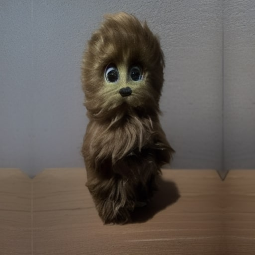
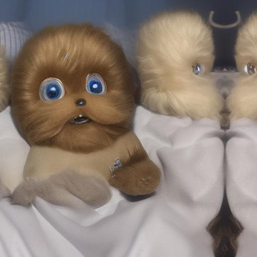
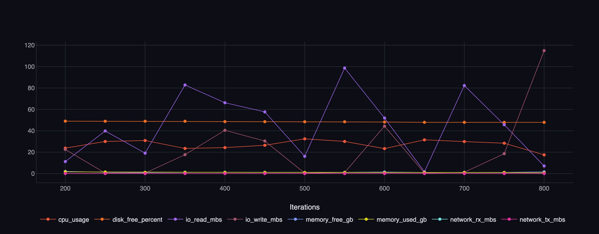

# Обучение LoRA-адаптера для диффузионной модели

Автор - Панченко Василий Игоревич

### Постановка задачи

Задача проекта - обучить LoRA для базовой диффузионной модели, чтобы она могла хорошо генерировать какой-то конкретный объект.

### Формат входных и выходных данных

На вход подаются 50+ фотографий объекта в масштабом 512х512, сделанные на телефон в формате `.HEIC`.

### Метрики

Основные метрики во время обучения модели - Loss для текстового энкодера, Loss для эмбедингов обучения, Loss текстового энкодера LoRA, Loss общих градиентов, Loss UNet LoRA, Loss Curve. Также будут передаваться данные нагрузки машины, на которой будет считаться проект.

### Эксперименты будут оцениваться с помощью следующих метрик:

Dino. Ожидается в районе 0.6 - 0.8, как у оригинальной диффузионной модели. Выбор метрики связан с пониманием классов. Метрика устойчива к стилевым изменениям.
Text_sim. Чем больше тем лучше. Метрика оценивает соответствие текстовому описанию.

### Валидация и тест

Предполагается разбиение на тренировочный и валидационный выборки в пропорциях 80:20. Для воспроизводимости результата, фотографии будут записаны на яндекс диске, а инструкции по запуску обучения и прогноза модели будут прописаны в `README.md`.

### Датасеты

Основной датасет будет состоять из 50-200 фотографий одного объекта с разным фоном, ракурсом и расположением объекта. Также необходимо добавить текстовое описание в файл `captions.txt` к каждой фотографии, а объект обозначить через метку `sksToy`.
Для лучшего результата обучения модели важно, чтобы входные данные были разнообразными, иначе модель быстро переобучится, и также важно следить за качеством описания фотографий.
Пример входных данных без обработки:
https://disk.360.yandex.ru/d/d_2ADwdTPRPs8A
Пример входных данных с текстовым описанием на вход модели:
https://disk.360.yandex.ru/d/a2_bgE1W3E_rqA

### Моделирование

### Бейзлайн

Запуск базовой диффузионной модели по промту, где обязательно будет слово sksToy в промте. Модель изначально не знает такого слова и будет показывать только шум, если в промте будет только это слово, или же будет опираться на другие слова в промте игнорируя ключевое слово.

Простой безлайн представлен в файле - baseline.ipynb. Как можно заменить на сгенерируемых фотографиях базовой модели нет ничего схожего с объектом, которому пытаемся обучить модель.

### Основная модель

Главная модель в проекте основана на архитектуре Stable Diffusion с применением метода LoRA (Low-Rank Adaptation) для эффективной дообучения. Модель использует диффузионный процесс для генерации изображений из текстовых описаний через U-Net архитектуру с механизмом внимания. Обучение проводится методом fine-tuning с замороженными весами базовой модели и обучением только низкоранговых адаптеров LoRA, что значительно сокращает вычислительные затраты.
Система поддерживает как Stable Diffusion 1.x, так и SDXL, автоматически определяя архитектуру на основе конфигурации модели. Для валидации используются метрики качества генерации и визуальная оценка сгенерированных изображений, что позволяет контролировать процесс обучения и сохранять лучшие веса.

### Внедрение

Проект реализован на базе Hydra для управления конфигурациями экспериментов. Интеграция с ClearML позволяет автоматически отслеживать метрики, артефакты и сгенерированные изображения в реальном времени. Код поддерживает распределенное обучение и может быть развернут в вычислительной среде института AIRI для проведения масштабных экспериментов.

## Setup

```sh
   git git@github.com:PanchenkoVI/lora-diffusion.git
   cd /lora-diffusion
```

Основные все шаги уже записаны в bash файлы.
Для запуска проекта достаточно только набрать:

1. **Train:**

   ```sh
      sh train_run.sh
   ```

Там рассматриваются команды:

```sh

   # Создание виртуальное окружения
   python3.9 -m venv venv

   # Активация окружения
   source venv/bin/activate

   # Установка зависимостей
   pip install --upgrade pip
   pip install poetry==1.7.0
   poetry install --no-root

   # pre-commit
   poetry run pre-commit run --all-files || true

   # Получение данных через (DVC / fallback)
   poetry run python - <<EOF
   from src.data.data_manager import DataManager

   dm = DataManager()
   if not dm.download_data():
      raise RuntimeError("Не удалось получить данные")
   EOF

   # А также запуск обучения модели через параметр гидры
   HYDRA_FULL_ERROR=1 poetry run python train.py
```

Так как метрики не отображают реальную ситуация с обчением модели, поэтому оставил папку с сохранением логов и результатов генерации, как локально так и в clearml.
Пример работы на обучении:

- Основной объект


- Сгенерированный объект во время обучения
  

2. **Inference:**

   ```sh
      sh infer_run.sh
   ```

Отличие от bash Файла обучения в команде - HYDRA_FULL_ERROR=1 poetry run python inference.py

- Как пример результата работы, сгенерируемый объект на этапе Inference
  

#### Важные замечания

- Этап Inference запускать только после обучения 4 эпох обучения.
- Проект откидывает логирование (метрики), а также фотографии на clearml и в базовом варианте чтобы их увидеть необхоидмо установить сервис.

Метрики Dino заметны на этапе Inference, а логирование из clearml во время обучения (пример):

